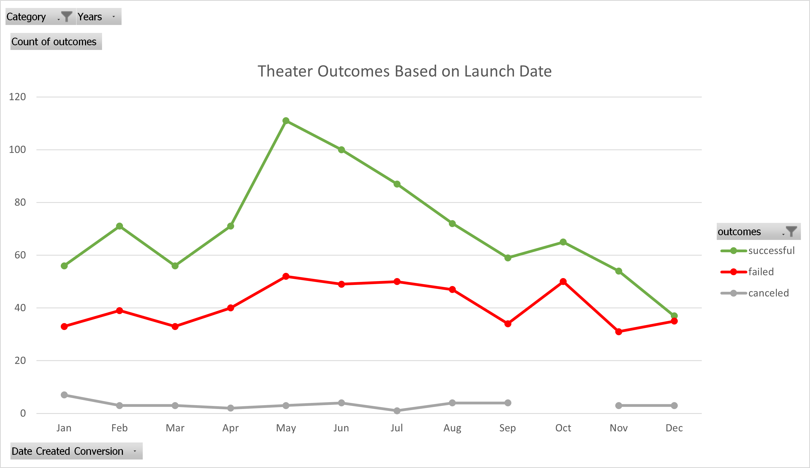
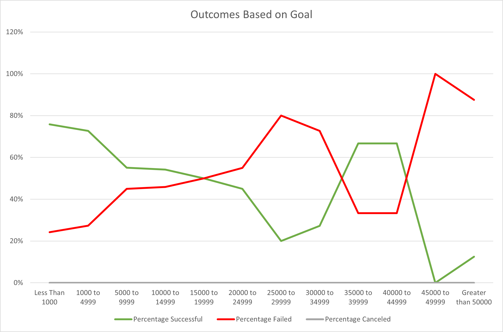
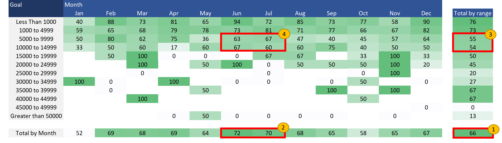
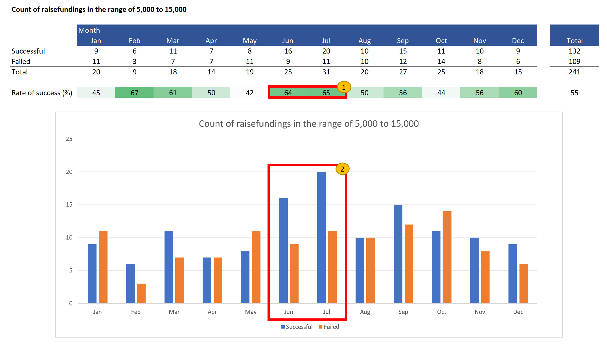

# Kickstarting with Excel

## Overview of Project

### Background

- A playwriter wants to launch her first raise funding campaign to obtain 10,000 USD that will be used to cover her new play “Fever” estimated budget.

### Purpose

- The objective of this analysis is to deliver practical insights trough the analysis of other Kickstarter campaigns that could increase the playwriter’s chances to have a successful raise funding campaign.

## Analysis and Challenges

- The following analysis is based on 4114 Kickstarter campaigns created between 2009-05-17 and 2017-03-15.

### Analysis of Outcomes Based on Launch Date

- Successful campaigns are defined as achieving 100% of the campaigns goal.
- As is observed in the following Chart between May and July more campaigns where successful vs other months, in quantity and as a percentage of the same month.

Note: Parent Category: Theater, 1369 cases

### Analysis of Outcomes Based on Goals

- Analyzing the outcome vs intended goal of the 1047 plays included in our campaigns database, the rate of success of campaigns near to our playwriter goal ($10,000 USD) is near to 50%.
- A deeper look in the information is recommended.

### Crossing Raise Funding Goals and Launch Date

1. Overall rate of success for the 1047 plays is 66%.
2. The months with the higher rate of success are June and July.
3. But for the goal ranges around our objective of $10,000 USD ("5000 to 9999" and "10000 to 14999") the overall rate of success are 55% and 54% respectively, lower than the overall or 66%. 
4. Are June and July still the best option for this amount of goal as there are other months with higher rates of success? (February 80%, April 75%, September 75%).

### Total Raise Fundings in the range of 5,000 USD to 15,000 USD

1. Analyzing the 241 cases around our goal of 10,000 USD (from 5000 USD to 14999 USD) the rate of success of June and July are 64% and 65% respectively, higher that the overall rate of 55%, but still under the rate of February (67%).
2. But as observed in the chart the number of successful cases are significantly higher in June and July.

### Challenges and Difficulties Encountered

- Percentage rates could be misleading as erratic behavior is expected with small samples

## Results

- What are two conclusions you can draw about the Outcomes based on Launch Date?
  - May, June, and July appears to be the best moths to launch a campaign from this perspective.
  - December seems to be the worst month to launch a campaign

- What can you conclude about the Outcomes based on Goals?
  - Campaigns with lower goals than 5,000 USD have a higher success rate.
  - In general as the goal amount rises the risk of failure increases, in the range of 35,000 USD to 44,999 USD have higher success rates than expected but it could be affected by the fact that there are only nine observations in this range.

- What are some limitations of this dataset?
  - The data set is somehow outdated, having a more updated set could drive to other conclusions as the fundraising culture has been developing very fast.
  - Also is not clear if the dataset is a sample or not for the Kickstarter campaigns or if it the sample could be skewed somehow.

- What are some other possible tables and/or graphs that we could create?
  - A deeper look around the target of 10,000 USD was recommended, a heatmap and bars chart were used to illustrate this range and help to conclude which months are the best according to this dataset to launch our clients fundraising.

### Conclusion

- Launching the campaign in the months of June and July seems to be the best options to increase the chances of success for a fund raising campaign of 10,000 USD.
